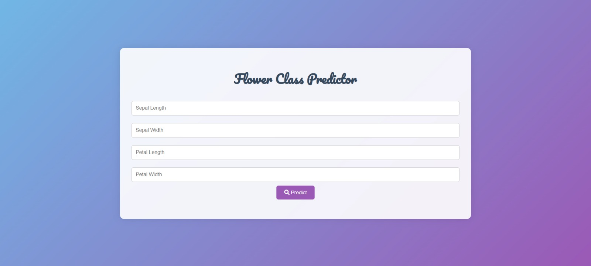
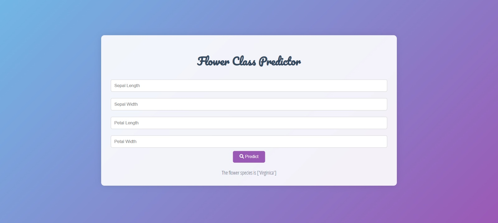

# Flower Class Predictor

**Punchline:** Predict the species of a flower using a Flask web application.

## Description

This project is a web application built with Flask that predicts the species of a flower based on the input features (sepal length, sepal width, petal length, and petal width). It uses a pre-trained machine learning model (stored in `model.pkl`) to make predictions.

## Table of Contents

- [Installation](#installation)
- [Usage](#usage)
- [Demo](#demo)
- [Results](#results)
- [Contributing](#contributing)
- [License](#license)
- [Acknowledgements](#acknowledgements)

## Installation

To get this project up and running on your local machine, follow these steps:

1. Clone the repository:

    ```bash
    git clone https://github.com/muhammadwaleedyasin/Flask-Web-App-Flower-Prediction-.git
    cd Flask-Web-App-Flower-Prediction-
    ```

2. Create and activate a virtual environment (optional but recommended):

    ```bash
    python -m venv venv
    source venv/bin/activate  # On Windows use `venv\Scripts\activate`
    ```

3. Install the required packages:

    ```bash
    pip install -r requirements.txt
    ```

4. Run the Flask app:

    ```bash
    python app.py
    ```

## Usage

1. Open your web browser and go to `http://127.0.0.1:5000/`.
2. Enter the flower's features (sepal length, sepal width, petal length, and petal width) in the form.
3. Click the "Predict" button to see the predicted species of the flower.

## Demo

Here are some screenshots of the application in action:




## Results

The application predicts the species of a flower based on the input features. The prediction is displayed on the same page after you submit the form.

## Contributing

If you want to contribute to this project, follow these steps:

1. Fork the repository.
2. Create a new branch.
3. Make your changes.
4. Submit a pull request.

## License

This project is licensed under the MIT License - see the [LICENSE](LICENSE) file for details.

## Acknowledgements

- Thanks to the creators of Flask for their excellent web framework.
- Thanks to the UCI Machine Learning Repository for the Iris dataset.
- Thanks to the developers who contributed to the libraries used in this project.

